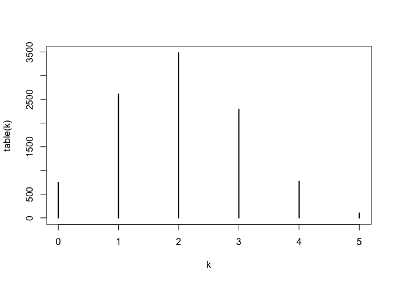
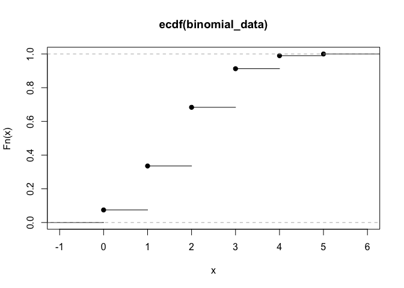
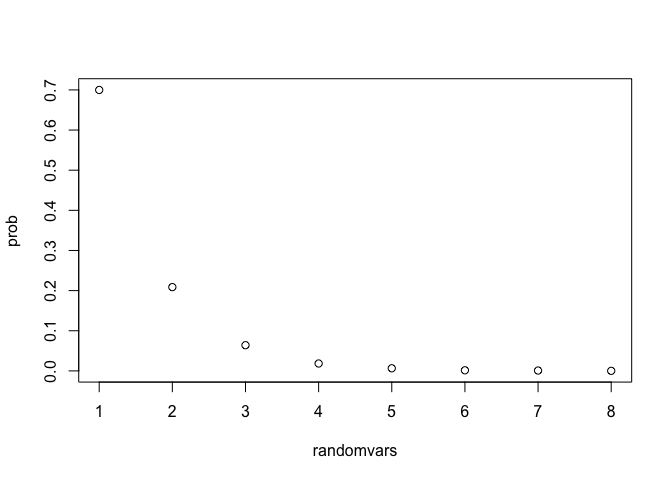
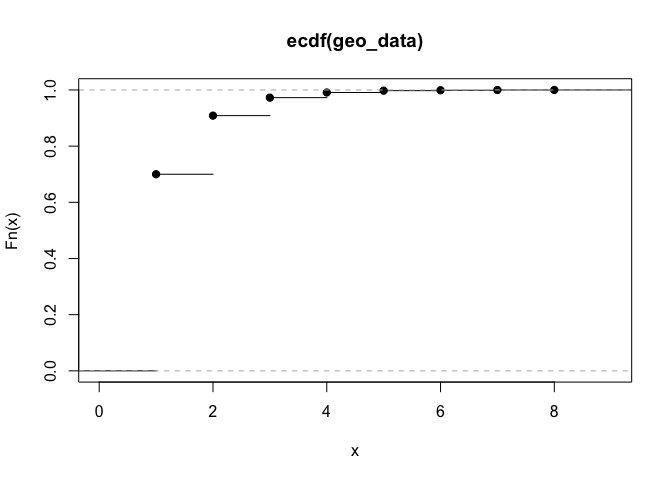
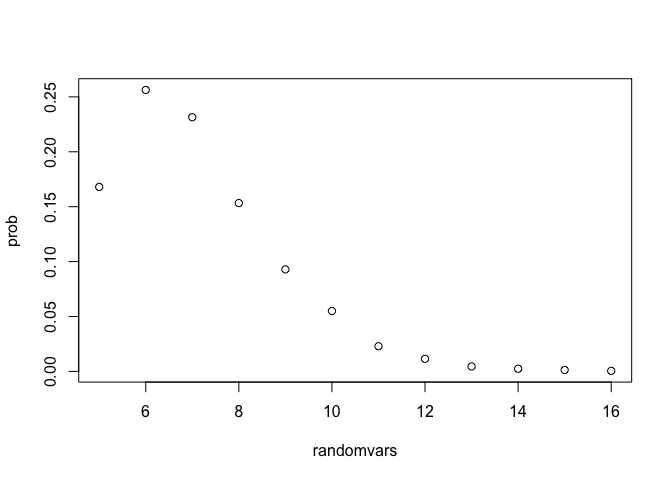
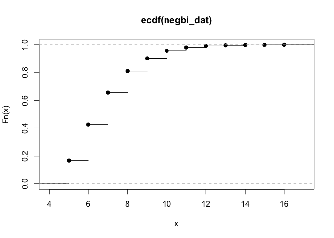
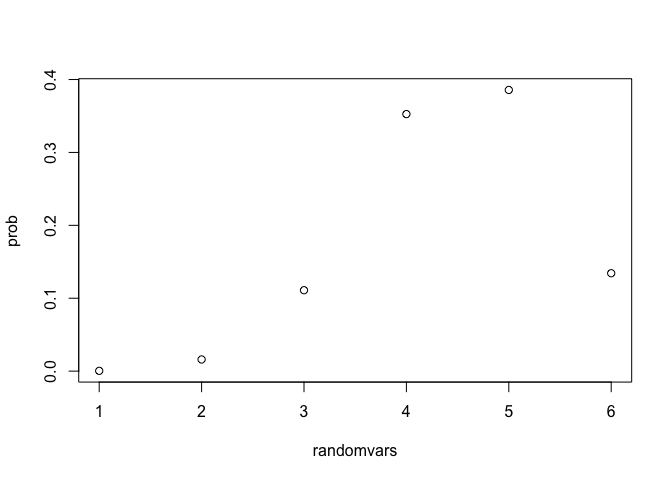
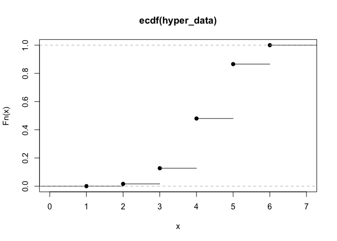

1. Generating Binomial Data
===========================

Write a function that generates N binomial data points for some n and some p. You not allowed to use the *rbinom* function in R. Then use this function to print an estimate of the PMF for a Binomial distribution with n = 5 and p = 0.4 based on N = 10000 generated data points and plot your PMF as a barplot. Then use the *plot(ecdf())* function to plot an empirical cumulative distribution function, an estimate of the true CDF. Use your results to estimate the true mean and variance of the distribution using the expectation and variance formulas. Hint: you will want to use the *sample* command to generate bernoulli trials and then summarize them appropriately.

``` r
BinomialFun <- function(N, n, p) {
  results = rep(0, N) # vector to store results of experiment 
  for(i in 1:N) {
    # run 5 trials of the experiment... (flip coin 5 times), with probability of no heads as 1-p, probability of heads as p
    results[i] = sum(sample(c(0,1), n, replace = TRUE, prob = c(1-p, p))) 
  }
  results
}
```

``` r
# pmf plot 
print_pmf <- function(k){
  plot(table(k))/sum(table(k))
}
```

``` r
# binomial mean

binom_mean <- function(dat){
  random_vars <- sort(unique(dat))
  probs <- as.vector(table(dat)/sum(table(dat)))
  expectation <- sum(random_vars * probs)
  return(expectation)
}

# binomial variance 

binom_variance <- function(dat){
  random_vars <- sort(unique(dat))
  probs <- as.vector(table(dat)/sum(table(dat)))
  expectation <- sum(random_vars * probs)
  variance <- sum((random_vars - expectation)^2 * probs)
  return(variance)
}
```

### Print pmf of binomial distribution



    ## [1] 0e+00 1e-04 2e-04 3e-04 4e-04 5e-04

### Print cdf of binomal distribution



### Print mean and variance

    ## [1] "The mean of the distribution is 2.0041"

    ## [1] "The variance of the distirbution is 1.18888319"

2. Generating Geometric Data
============================

Write a function that generates N geometric data points for some p. You not allowed to use the *rgeom* function in R. Then use this function to print an estimate of the PMF for a Geometric distribution with p = 0.7 based on N = 10000 generated data points and plot your PMF as a barplot. Then use the *plot(ecdf())* function to plot an empirical cumulative distribution function, an estimate of the true CDF. Use your results to estimate the true mean and variance of the distribution using the expectation and variance formulas. Hint: you will want to use the *sample* command to generate bernoulli trials and then summarize them appropriately.

``` r
# generate geometric data function 

  # geometric data is # of trials until we get the outcome we desire, i.e number of times flip coin until heads 
geo_fun <- function(N, p){
  results <- rep(0, N) # results vector for # of simulations N 
  
  for(i in 1:N){
    x = 0 
    k = 0 # number of trials to we hit heads
      while(x == 0){ # as long as x == 0, the outcome we do not want i.e. tails then sample again until we hit heads (1)
        x = sample(c(0,1), 1, replace = T, prob = c(1-p, p))
        k = k + 1 # we add to k to indicate the # of times it takes for us to hit heads, if heads is hit on first try, it                   # will equal 1 
      }
    results[i] <- k # store results, the number of times to hit desired outcome, in results vector
  }
  return(results)
}

# print pmf of geometric distribution function 
geom_pmf <- function(geom_dat){
  randomvars <- sort(unique(unique(geom_dat))) 
  prob <- as.vector(table(geom_dat)/sum(table(geom_dat)))
  plot(prob ~ randomvars)
}
```

``` r
# mean of geometric distribution 
geom_mean <- function(geom_dat){
  random_vars  <- sort(unique(geom_dat))
  prob <- as.vector(table(geom_dat)/sum(table(geom_dat)))
  expectation <- sum(random_vars * prob)
  return(expectation)
}

# variance of geometric distribution
geom_var <- function(geom_dat){
  random_vars  <- sort(unique(geom_dat))
  prob <- as.vector(table(geom_dat)/sum(table(geom_dat)))
  expectation <- sum(random_vars * prob)
  
  variance <- sum((random_vars - expectation)^2 * prob)
  return(variance)
}
```

### Print pmf of geometric distribution



### Print cdf of geometric distribution



### Print mean of geometric distribution

    ## [1] "The mean of the geometric distribution is 1.4315"

    ## [1] "The variance of the geometric distribution is 0.62290775"

3. Generating Negative Binomial data
====================================

Write a function that generates N negative binomial data points for some r (number of successes) and some p. You not allowed to use the *rnbinom* function in R. Then use this function to print an estimate of the PMF for a Negative Binomial distribution with p = 0.7 and r = 5 based on N = 10000 generated data points and plot your PMF as a barplot. Then use the *plot(ecdf())* function to plot an empirical cumulative distribution function, an estimate of the true CDF. Use your results to estimate the true mean and variance of the distribution using the expectation and variance formulas. Hint: you will want to use the *sample* command to generate bernoulli trials and then summarize them appropriately.

``` r
## negative binomial distribution 
gen_negbi <- function(N, r, p){
  results <- rep(0, N) # generate results vector, in this case, the results generate number of trials it takes to get the rth                        # success, i.e # of trials until we reach 5 heads
    for(i in 1:N){
      success <- 0 # keeps track of success... for each iteration (once it hits r will stop loop)
      n <- 0  # keeps track of # of trials until we reach r (the number of successes we want)
        while(success < r){ # we will run loop until success reaches the # we want (r)
              success <- success + sample(c(0,1), 1, replace = T, prob = c(1-p, p)) # we willrepeat sample and for each
              # sample we will add it to success 
              n <- n + 1 # keeps track of number of trials
        }
      
    results[i] <- n # stores number of trials for each iteration
    
    }
  return(results)
}

## negative binomial pmf 
negbi_pmf <- function(negbi_dat){
  randomvars <- sort(unique(unique(negbi_dat))) 
  prob <- as.vector(table(negbi_dat)/sum(table(negbi_dat)))
  plot(prob ~ randomvars)
}
```

``` r
# negative binomial mean
negbi_mean <- function(negbi_dat){
  random_vars  <- sort(unique(negbi_dat))
  prob <- as.vector(table(negbi_dat)/sum(table(negbi_dat)))
  expectation <- sum(random_vars * prob)
  return(expectation)
}

# negative binomial var 
negbi_var <- function(negbi_dat){
  random_vars  <- sort(unique(negbi_dat))
  prob <- as.vector(table(negbi_dat)/sum(table(negbi_dat)))
  expectation <- sum(random_vars * prob)
  
  variance <- sum((random_vars - expectation)^2 * prob)
  return(variance)
}
```

### Plot negative binomial pmf



### Plot negative binomial cdf



### Mean and Variance of negative binomial distribution

    ## [1] "The mean of the negative binomial distribution is 7.1191"

    ## [1] "The variance of the negative binomial distribution is 2.98871519"

4. Generating Hypergeometric data
=================================

Write a function that generates N hypergeometric data points for some total population size, m, some number of \`\`tagged'' elements, r, and some number of elements sampled, k. You not allowed to use the *rhyper* function in R. Then use this function to print an estimate of the PMF for a Hypergeometric distribution with m = 20, r = 15, k = 6 based on N = 10000 generated data points and plot your PMF as a barplot. Then use the *plot(ecdf())* function to plot an empirical cumulative distribution function, an estimate of the true CDF. Use your results to estimate the true mean and variance of the distribution using the expectation and variance formulas. Hint: you will want to use the *sample* command on an appropriately created population.

``` r
# N - Total # 
# n - tagged
# m - new sample 
# k -  how many of new sample were previously tagged 
      # how many of m = n 

HyperGeoFun <- function(N, m, r, k) {
  
  population = rep(c(1,0), c(r, m-r)) # population with the total tagged and untagged elements. 
  results = rep(0, N) # a vector that stores the results 
  
  for (i in 1:N) {
  y = sum(sample(population, k ,replace = F))  
  # sampling the population, getting sum to identify the number of tagged elements from the population. 
  results[i] = y
  }
  results
}

# plot pmf 
hyper_pmf <- function(hyper_dat){
  randomvars <- sort(unique(unique(hyper_dat))) 
  prob <- as.vector(table(hyper_dat)/sum(table(hyper_dat)))
  plot(prob ~ randomvars)
}
```

### Plot hypergeometric pmf



### Plot hypergeometric cdf



### Mean and variance of hypergeometric distribution

    ## [1] "The mean of hypergeometric distribution is 4.5101"

    ## [1] "The variance of hypergeometric distribution is 0.84129799"
